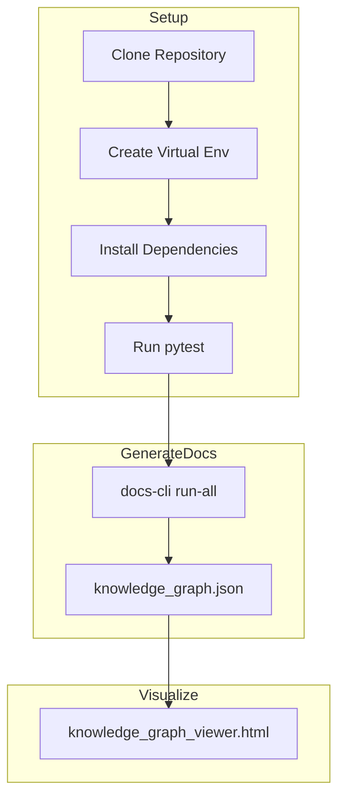

# QuickStart Guide

This guide helps you get up and running with the Codex Web-Native repository as quickly as possible.

## Setup

1. **Clone the repository** and navigate into it.
2. **Create a virtual environment**:
   ```bash
   python -m venv venv
   source venv/bin/activate
   ```
3. **Install dependencies**:
   ```bash
   pip install -r requirements.txt
   ```
4. **Run tests** to verify everything works:
   ```bash
   pytest
   ```

## Run the NLU Documentation Pipeline

Execute the documentation pipeline to generate reports and the knowledge graph:
```bash
./tools/nlu/docs-cli run-all
```
This command creates analysis reports in `docs/synthesis/reports/` and produces `knowledge_graph.json` used by the visualization.

## Explore the Knowledge Graph

Open the visualizer in your browser:
```bash
open docs/synthesis/visualizations/knowledge_graph_viewer.html
```
(or use `xdg-open`/`start` depending on your OS.)
Use the layer and relationship filters to inspect how prompts, code, docs and audits relate.

## QuickStart Flow



Follow this flow to see the system in action in just a few commands.
